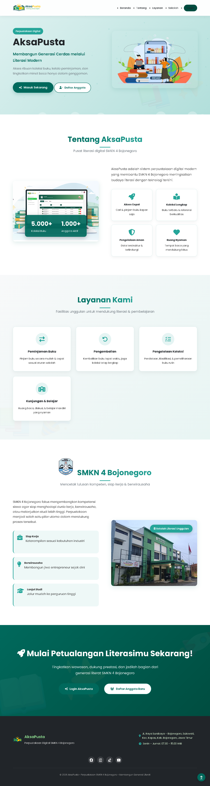
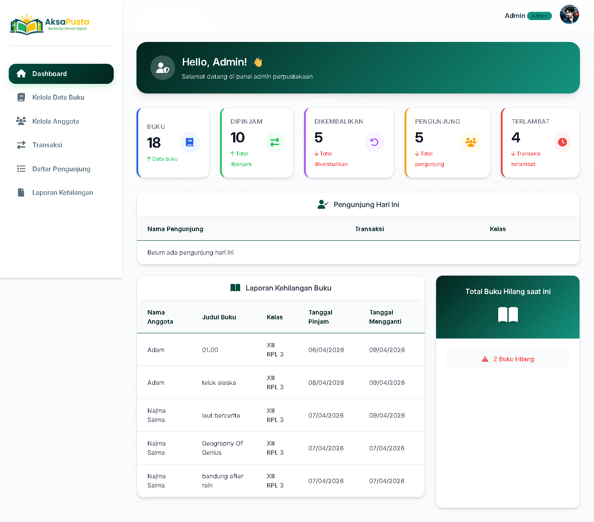
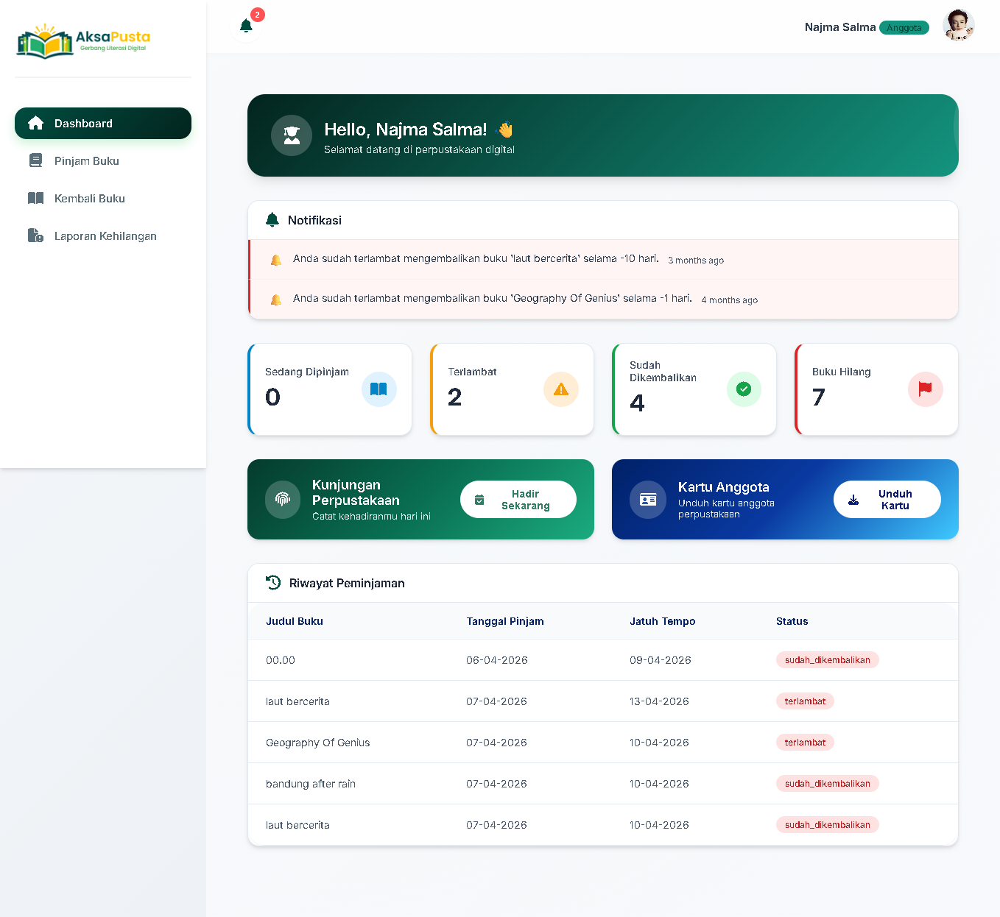

# 📚 Perpustakaan Sekolah

> **Kelola perpustakaan sekolah dengan lebih mudah** — buku, anggota, transaksi, dan laporan dalam satu aplikasi.

<p align="center">
  
  
  
  
</p>

---

## ✨ Fitur Unggulan

| Fitur | Deskripsi |
|---|---|
| 📘 **Manajemen Buku** | CRUD, impor, dan ekspor data buku |
| 🗂️ **Rak & Baris** | Atur lokasi fisik setiap buku |
| 🧾 **Peminjaman** | Pinjam, kembali, histori, dan denda |
| 👥 **Anggota** | Registrasi dan riwayat peminjaman |
| 📊 **Laporan** | Kunjungan, transaksi, dan buku hilang |
| 🔐 **Role** | Admin, Petugas, dan Anggota |

## 🖼️ Tampilan Aplikasi

> Simpan gambar di folder `docs/screenshots/`

| Landing | Dashboard Admin |
|---|---|
|  |  |

| Dashboard Anggota | Transaksi |
|---|---|
|  |  |

## 🛠️ Teknologi

<p align="center">
  
</p>

## 🚀 Instalasi

```bash
git clone https://github.com/najma7527/Project_perpustakaan_individu.git
cd Project_perpustakaan_individu

composer install
cp .env.example .env
php artisan key:generate

# atur koneksi database di .env

php artisan migrate --seed
npm install
npm run dev
php artisan serve
```

Buka **http://127.0.0.1:8000**

## 📂 Struktur Singkat

```text
app/
resources/views/
routes/
public/
docs/screenshots/
```

## 👥 Peran Pengguna

| Peran | Akses |
|---|---|
| **Admin** | Kelola seluruh data dan laporan |
| **Petugas** | Kelola transaksi dan buku |
| **Anggota** | Lihat katalog dan riwayat peminjaman |

## 🤝 Kontribusi

1. Fork repositori
2. Buat branch fitur (`git checkout -b fitur-baru`)
3. Commit perubahan
4. Push dan buka Pull Request

## 📄 Lisensi

Dirilis dengan lisensi **MIT**.
